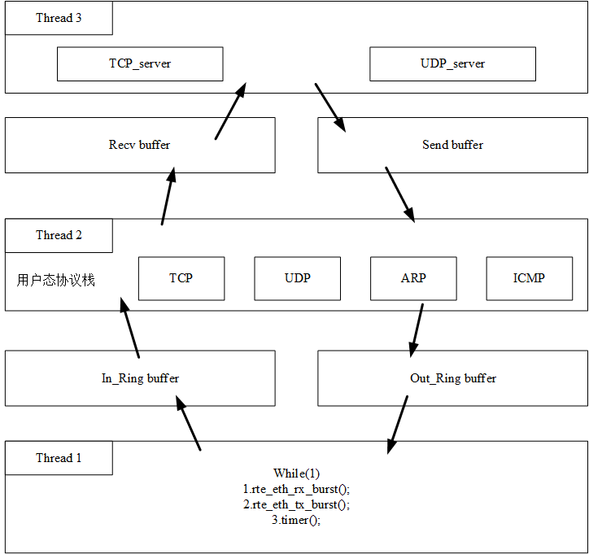

# 用户态服务器实现

## 协议栈内容
主要包括接收队列（RX TX burst） ring_buffer 用户态协议栈（ARP、ICMP、TCP、UDP）



---

## UDP Server 启动与打流测试

以下命令按顺序执行，在 `chapter_2/udp_server/` 目录下操作。

### 1. 环境检查

```bash
# 确认 DPDK 已安装
pkg-config --modversion libdpdk

# 确认 hugepages 已配置（至少 512 个 2MB 页）
grep HugePages /proc/meminfo

# 确认 /dev/net/tun 可用（TAP 模式需要）
ls -la /dev/net/tun
```

如果 hugepages 不足，执行：
```bash
sudo sh -c 'echo 1024 > /sys/kernel/mm/hugepages/hugepages-2048kB/nr_hugepages'
sudo chmod 777 /dev/hugepages
```

### 2. 编译

```bash
make clean && make
```

### 3. 启动 DPDK UDP Server（TAP 模式）

TAP 模式创建内核可见的虚拟网卡 `dpdk_tap`，无需真实物理网卡即可在本机测试。

```bash
# 清理上次运行的残留文件
sudo rm -f /dev/hugepages/rtemap_* /dev/hugepages/udp_*
sudo rm -rf /var/run/dpdk/

# 启动服务器（后台运行）
sudo ./build/dpdk_udp \
    -l 0-2 -n 4 -m 256 \
    --file-prefix=udp_srv \
    --vdev=net_tap0,iface=dpdk_tap \
    -- \
    --local-ip 192.168.76.200 \
    --local-port 8888 \
    > /tmp/dpdk_udp.log 2>&1 &

# 启动服务器（前台运行）
sudo ./build/dpdk_udp \
    -l 0-2 -n 4 -m 256 \
    --file-prefix=udp_srv \
    --vdev=net_tap0,iface=dpdk_tap \
    -- \
    --local-ip 192.168.76.200 \
    --local-port 8888 \ 
```

参数说明：
| 参数 | 含义 |
|------|------|
| `-l 0-2` | 使用 lcore 0/1/2（主线程 + 2 个 worker） |
| `-m 256` | 分配 256MB hugepage 内存 |
| `--vdev=net_tap0,iface=dpdk_tap` | 创建 TAP 虚拟网卡 |
| `--local-ip 192.168.76.200` | DPDK 服务端 IP |
| `--local-port 8888` | 监听端口 |

> **注意**：lcore 0 保留给主循环（RX/TX），lcore 1 运行 `pkt_process`，lcore 2 运行 `udp_server_entry`。不要在 lcore 0 上 `rte_eal_remote_launch`。

### 4. 配置 TAP 接口并验证连通性

```bash
# 给 dpdk_tap 配置内核端 IP（与 DPDK 同子网）
sudo ip addr add 192.168.100.2/24 dev dpdk_tap
sudo ip link set dpdk_tap up

# 验证 ARP + ICMP（DPDK 协议栈会回复）
ping -c 2 -I dpdk_tap 192.168.76.200

# 验证 UDP Echo
echo "HELLO DPDK" | nc -u -s 192.168.100.2 -p 9999 192.168.76.200 8888
```

### 5. 吞吐量打流测试

```bash
python3 /tmp/udp_throughput_test.py \
    --ip 192.168.76.200 \
    --port 8888 \
    --local-ip 192.168.100.2 \
    --size 64 \
    --duration 10
```

Python 测试脚本 `udp_throughput_test.py`：

```python
#!/usr/bin/env python3
"""UDP 吞吐量测试客户端"""
import socket, time, argparse

def main():
    parser = argparse.ArgumentParser()
    parser.add_argument('--ip', default='192.168.76.200')
    parser.add_argument('--port', type=int, default=8888)
    parser.add_argument('--size', type=int, default=64)
    parser.add_argument('--count', type=int, default=50000)
    parser.add_argument('--local-ip', default='192.168.76.127')
    parser.add_argument('--duration', type=int, default=10)
    args = parser.parse_args()

    sock = socket.socket(socket.AF_INET, socket.SOCK_DGRAM)
    sock.settimeout(0.05)
    sock.bind((args.local_ip, 0))
    sock.setsockopt(socket.SOL_SOCKET, socket.SO_SNDBUF, 256*1024)
    sock.setsockopt(socket.SOL_SOCKET, socket.SO_RCVBUF, 256*1024)

    payload = b'X' * args.size
    sent = recv = s_cnt = r_cnt = 0
    start = time.time()
    end = start + args.duration

    while time.time() < end:
        try:
            sock.sendto(payload, (args.ip, args.port))
            s_cnt += 1; sent += args.size
        except:
            pass
        try:
            data, _ = sock.recvfrom(args.size + 100)
            if data:
                r_cnt += 1; recv += len(data)
        except socket.timeout:
            pass
        except:
            pass

    elapsed = time.time() - start
    print(f'发送: {s_cnt} 包, {sent*8/elapsed/1e6:.2f} Mbps, {s_cnt/elapsed:.0f} pps')
    print(f'接收: {r_cnt} 包, {recv*8/elapsed/1e6:.2f} Mbps, {r_cnt/elapsed:.0f} pps')
    print(f'丢包: {s_cnt - r_cnt} ({(s_cnt-r_cnt)*100/max(s_cnt,1):.2f}%)')
    sock.close()

if __name__ == '__main__':
    main()
```

> **性能提示**：测试前注释掉 `src/udp_server.c` 中 `nsendto()` 的 `printf` 和 `src/udp/udp.c` 中 `ng_encode_udp_pkt()` 的 `printf`，否则日志 I/O 会成为瓶颈。当前版本 64 字节包可达 ~75,000 pps / ~38 Mbps（受 printf 日志限制）。

### 6. 停止与清理

```bash
# 停止 DPDK Server
sudo kill $(pgrep -f dpdk_udp)

# 清理 TAP 接口
sudo ip link del dpdk_tap 2>/dev/null

# 清理 hugepage 残留
sudo rm -f /dev/hugepages/rtemap_* /dev/hugepages/udp_*
sudo rm -rf /var/run/dpdk/
```

### 7. 网络拓扑

```
┌──────────────┐         ┌─────────────────────────┐
│  测试客户端    │  UDP    │  DPDK UDP Server         │
│  (内核协议栈)  │ ──────→ │  (用户态协议栈)           │
│              │ ←────── │                          │
│ 192.168.100.2 │  Echo   │  192.168.76.200:8888      │
│              │         │  lcore 0: RX/TX 主循环     │
│  nc / Python  │         │  lcore 1: pkt_process     │
│              │         │  lcore 2: udp_server_entry │
└──────┬───────┘         └──────────┬──────────────┘
       │                            │
       └──────── dpdk_tap ──────────┘
            (TAP 虚拟网卡, 内核 ↔ DPDK)
```

### 备选模式：绑定物理网卡（PCI 直通，推荐性能最优）

将物理网卡从内核驱动解绑，绑定到 DPDK 用户态驱动（`vfio-pci` / `uio_pci_generic`），由 DPDK PMD 直接操控——零拷贝、无内核路径，性能最高。

#### 第一步：确认目标网卡

```bash
# 列出所有网卡及其 PCI 地址
lspci -nn | grep -i ethernet
# 或
dpdk-devbind.py --status
```

假设目标网卡 PCI 地址为 `0000:03:00.0`，接口名 `ens160`。

#### 第二步：加载 DPDK 内核驱动

```bash
# 加载 vfio-pci（推荐，需要 IOMMU 支持）
sudo modprobe vfio-pci

# 若无 IOMMU，使用 uio_pci_generic 作为备选
# sudo modprobe uio_pci_generic
```

#### 第三步：绑定网卡到 DPDK 驱动

```bash
# 先 down 掉网卡
sudo ip link set ens160 down

# 绑定到 vfio-pci
sudo dpdk-devbind.py -b vfio-pci 0000:03:00.0

# 验证绑定成功
dpdk-devbind.py --status
```

#### 第四步：启动 DPDK UDP Server

与 TAP 模式不同，无需 `--vdev` 参数。使用 `-a` 白名单指定 PCI 设备：

```bash
# 清理上次运行的残留文件
sudo rm -f /dev/hugepages/rtemap_* /dev/hugepages/udp_*
sudo rm -rf /var/run/dpdk/

# 启动服务器（前台运行）
sudo ./build/dpdk_udp \
    -l 0-2 -n 4 -m 256 \
    --file-prefix=udp_srv \
    -a 0000:03:00.0 \
    -- \
    --local-ip 192.168.76.200 \
    --local-port 8888 \
```

参数说明：
| 参数 | 含义 |
|------|------|
| `-a 0000:03:00.0` | 白名单：只使用该 PCI 网卡（替代 `--vdev`） |
| `-l 0-2` | 使用 lcore 0/1/2 |
| `--local-ip 192.168.76.200` | DPDK 服务端 IP（需与对端同子网） |

> **注意**：`--local-ip` 可设置为目标网卡原本的内核 IP 地址，对端机器用该 IP 发包即可。DPDK 接管网卡后内核网络栈不可见该接口（`ip addr` 不再显示），但网卡本身正常收发。

#### 第五步：从对端机器打流

在**另一台物理机器**（与 DPDK 服务器直连）上：

```bash
# ARP + ICMP 验证（DPDK 协议栈会回复）
ping 192.168.76.200

# UDP Echo 测试（Linux 或 WSL执行）
echo "HELLO DPDK" | nc -u -p 9999 192.168.76.200 8888
```

吞吐量打流同 [步骤 5](#5-吞吐量打流测试)，将对端 IP 改为 `192.168.76.200` 即可。

#### 恢复网卡到内核

```bash
# 停止 DPDK Server
sudo kill $(pgrep -f dpdk_udp)

# 解绑 vfio-pci，恢复内核驱动
sudo dpdk-devbind.py -u 0000:03:00.0
sudo dpdk-devbind.py -b <kernel_driver> 0000:03:00.0

# 或使用 --bind-status 查看原始驱动后恢复
# dpdk-devbind.py --status | grep 0000:03:00.0
```

---

### 备选模式：AF_PACKET（绑定物理网卡，无需 DPDK 驱动）

如果有真实网卡（如 `ens160`）但不想替换内核驱动，可用 AF_PACKET 模式——DPDK 通过内核 AF_PACKET socket 收发，性能低于 PCI 直通但无需改驱动。

替换步骤 3 的 `--vdev` 参数：

```bash
sudo ./build/dpdk_udp \
    -l 0-2 -n 4 -m 256 \
    --vdev=eth_af_packet0,iface=ens160 \
    -- \
    --local-ip 192.168.76.200 \
    --local-port 8888
```

此时从**另一台物理机器**向该网卡 IP 发送 UDP 包即可测试。

---

claude code使用策略：

/fewer-permission-prompts 添加白名单指令
